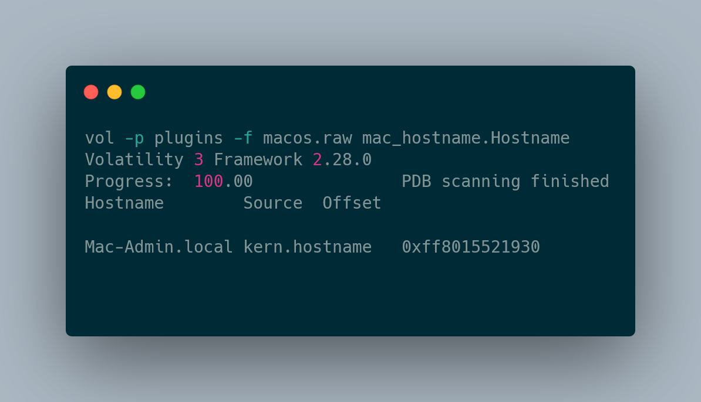
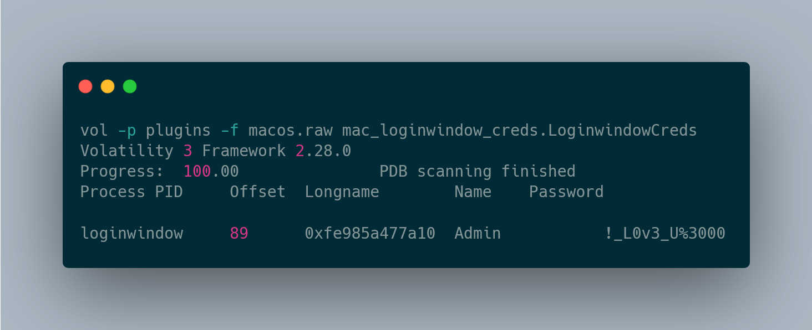

# macOS Volatility 3 Plugins

Needs an **ISF** matching the image's Darwin build.

## building ISF 

Build the ISF with [`dwarf2json`](https://github.com/volatilityfoundation/dwarf2json) and drop it in `volatility3/symbols/mac/`.Re-encode and run `vol --clear-cache`.
Read[https://mooofin.github.io/portfolio/blog/s4nct1m0ny.html] for how to build .